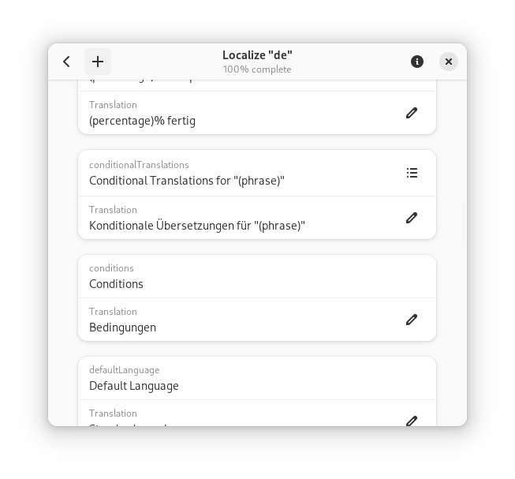

  
  <h1 align="center">Localizer</h1>

Localize GNOME apps built using Swift, and other Swift programs utilizing the [Localized](https://github.com/AparokshaUI/Localized) package.

## Table of Contents

- [Installation](#Installation)
- [Usage](#Usage)
- [Thanks](#Thanks)

## Installation

Download the Flatpak file from the latest release, open it in GNOME Software, and press the install button.

## Usage

Clone the app's repository and locate the `Localized.yml` file.
Import it into this app.

Then, start translating with the UI.

Once you're ready to commit, use again git and submit to the repository.

## Thanks

### Dependencies
- [Adwaita](https://github.com/AparokshaUI/Adwaita) licensed under the [MIT license](https://github.com/AparokshaUI/Adwaita/blob/main/LICENSE.md)
- [Localized](https://github.com/AparokshaUI/Localized) licensed under the [MIT license](https://github.com/AparokshaUI/Localized/blob/master/LICENSE.md)
